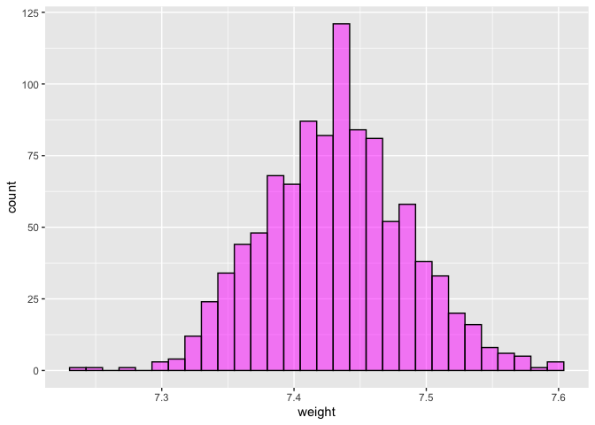

Lab 11 - Smoking during pregnancy
================
Lindsay Stall
4/3/23

### Load packages and data

``` r
library(tidyverse) 
library(tidymodels)
library(openintro)
library(skimr)
library(infer)
```

``` r
library(usethis)
use_git_config(user.name = "Lindsay Stall", 
               user.email = "stallm21@wfu.edu")
```

### Exercise 1

``` r
data(ncbirths)
```

``` r
summary(ncbirths)
```

    ##       fage            mage            mature        weeks             premie   
    ##  Min.   :14.00   Min.   :13   mature mom :133   Min.   :20.00   full term:846  
    ##  1st Qu.:25.00   1st Qu.:22   younger mom:867   1st Qu.:37.00   premie   :152  
    ##  Median :30.00   Median :27                     Median :39.00   NA's     :  2  
    ##  Mean   :30.26   Mean   :27                     Mean   :38.33                  
    ##  3rd Qu.:35.00   3rd Qu.:32                     3rd Qu.:40.00                  
    ##  Max.   :55.00   Max.   :50                     Max.   :45.00                  
    ##  NA's   :171                                    NA's   :2                      
    ##      visits            marital        gained          weight      
    ##  Min.   : 0.0   not married:386   Min.   : 0.00   Min.   : 1.000  
    ##  1st Qu.:10.0   married    :613   1st Qu.:20.00   1st Qu.: 6.380  
    ##  Median :12.0   NA's       :  1   Median :30.00   Median : 7.310  
    ##  Mean   :12.1                     Mean   :30.33   Mean   : 7.101  
    ##  3rd Qu.:15.0                     3rd Qu.:38.00   3rd Qu.: 8.060  
    ##  Max.   :30.0                     Max.   :85.00   Max.   :11.750  
    ##  NA's   :9                        NA's   :27                      
    ##  lowbirthweight    gender          habit          whitemom  
    ##  low    :111    female:503   nonsmoker:873   not white:284  
    ##  not low:889    male  :497   smoker   :126   white    :714  
    ##                              NA's     :  1   NA's     :  2  
    ##                                                             
    ##                                                             
    ##                                                             
    ## 

The cases are babies, and there are 1000 cases.

### Exercise 2

``` r
ncbirths_white <- ncbirths %>%
  filter(whitemom == "white")
```

``` r
mean(ncbirths_white$weight)
```

    ## [1] 7.250462

The mean white of babies born to white mother is 7.25

### Exercise 3

Yes? I believe so.

``` r
boot_df_weight <- ncbirths_white %>%
  specify(response = weight) %>% 
  generate(reps = 1000, type = "bootstrap") %>% 
  calculate(stat = "mean")

boot_df_weight <- boot_df_weight %>% 
  mutate(stat = (stat + (7.43-mean(ncbirths_white$weight))))

boot_df_weight %>% 
  ggplot(aes(x = stat)) +
  geom_histogram(color = "black",fill = "magenta", alpha = 0.5) +
  xlab("weight")
```

    ## `stat_bin()` using `bins = 30`. Pick better value with `binwidth`.

<!-- -->

``` r
sum((boot_df_weight$stat <= (mean(ncbirths_white$weight))) / length(boot_df_weight$stat)) +
sum((boot_df_weight$stat >= (7.43+(7.43-mean(ncbirths_white$weight)))) / length(boot_df_weight$stat))
```

    ## [1] 0.002

### Exercise 4

For a two-tailed test we would get a p-value of 0.002, which means there
has been a significant change.

### Exercise 5

``` r
ncbirths<-ncbirths %>% drop_na(habit)
```

``` r
ggplot(ncbirths, aes(habit, weight, fill=habit)) +
  geom_bar(stat="summary") +
  xlab("Smoking Habit") + ylab("Baby Weight (lbs)") +
  scale_fill_brewer(palette = "Accent") +
  ggtitle("Birth Weights of Infants by Mother's Smoking Habit")
```

    ## No summary function supplied, defaulting to `mean_se()`

<!-- -->

``` r
  theme(legend.position="none")
```

    ## List of 1
    ##  $ legend.position: chr "none"
    ##  - attr(*, "class")= chr [1:2] "theme" "gg"
    ##  - attr(*, "complete")= logi FALSE
    ##  - attr(*, "validate")= logi TRUE

Smoker’s babies weigh less

### Exercise 7

The null hypothesis would be that there is no difference in weight for
babies with mothers that do or do not smoke.

``` r
ncbirths_habit<- ncbirths %>%
  subset(select=c(weight, habit))
```

### Exercise 8

Yes, I believe so (though honestly could use clarification)

``` r
boot_df_smoker <- ncbirths_habit %>% 
  filter(habit == "smoker") %>%
  specify(response = weight) %>% 
  generate(reps = 1000, type = "bootstrap") %>% 
  calculate(stat = "mean")


boot_df_nonsmoker <- ncbirths_habit %>% 
  filter(habit == "nonsmoker") %>%
  specify(response = weight) %>% 
  generate(reps = 1000, type = "bootstrap") %>% 
  calculate(stat = "mean")

boot_df_diff <- (boot_df_nonsmoker$stat-boot_df_smoker$stat) %>% 
  as.data.frame() %>% 
  setNames("MeanDiff")

boot_df_diff_c <- (boot_df_diff$MeanDiff - mean(boot_df_diff$MeanDiff)) %>% 
  as.data.frame() %>% 
  setNames("MeanDiff")

sum((boot_df_diff_c$MeanDiff >= mean(boot_df_diff$MeanDiff))/length(boot_df_diff_c$MeanDiff)) +
sum((boot_df_diff_c$MeanDiff <= (mean(boot_df_diff$MeanDiff)*-1))/length(boot_df_diff_c$MeanDiff))
```

    ## [1] 0.021

The p-value is 0.01, so there is a difference in birth weight of babies
whose mothers smokes versus don’t smoke.

### Exercise 10
